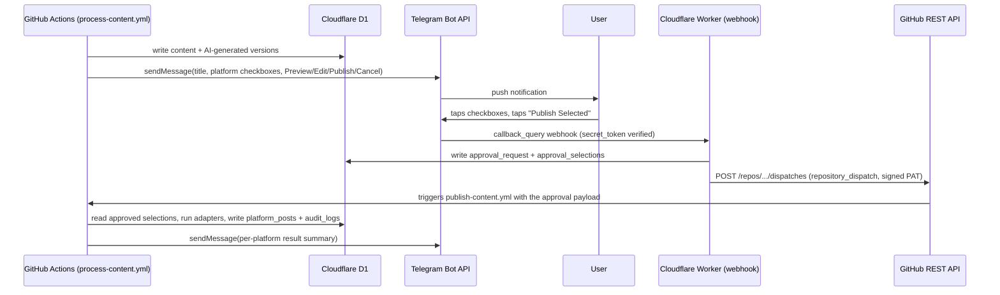
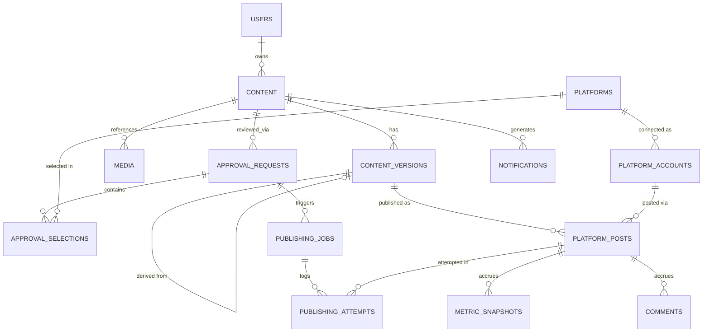
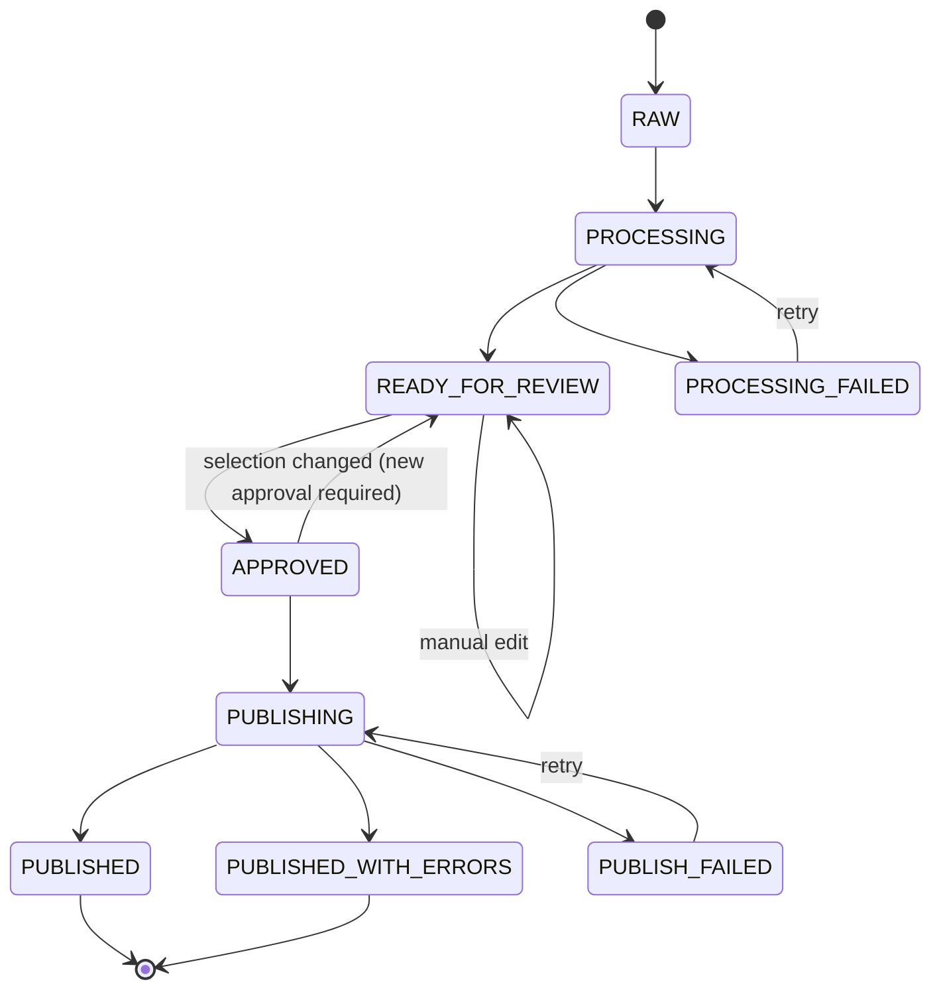
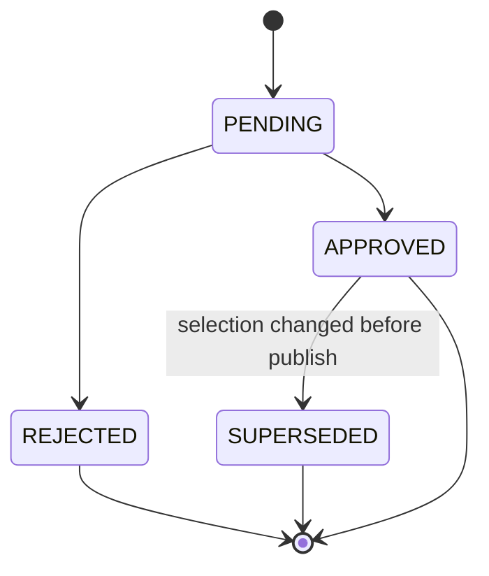
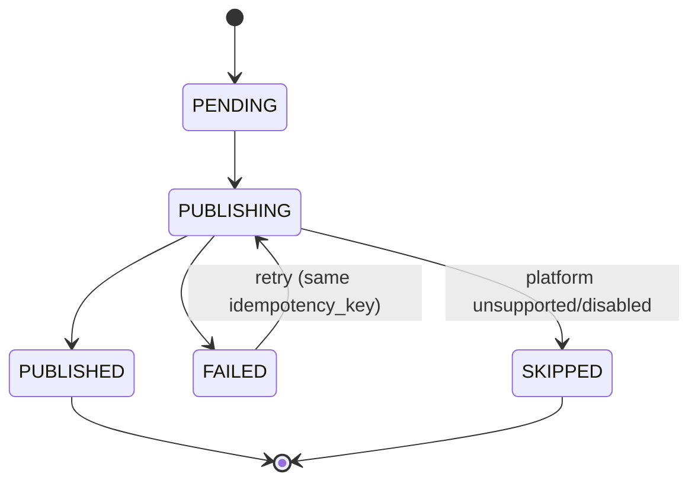
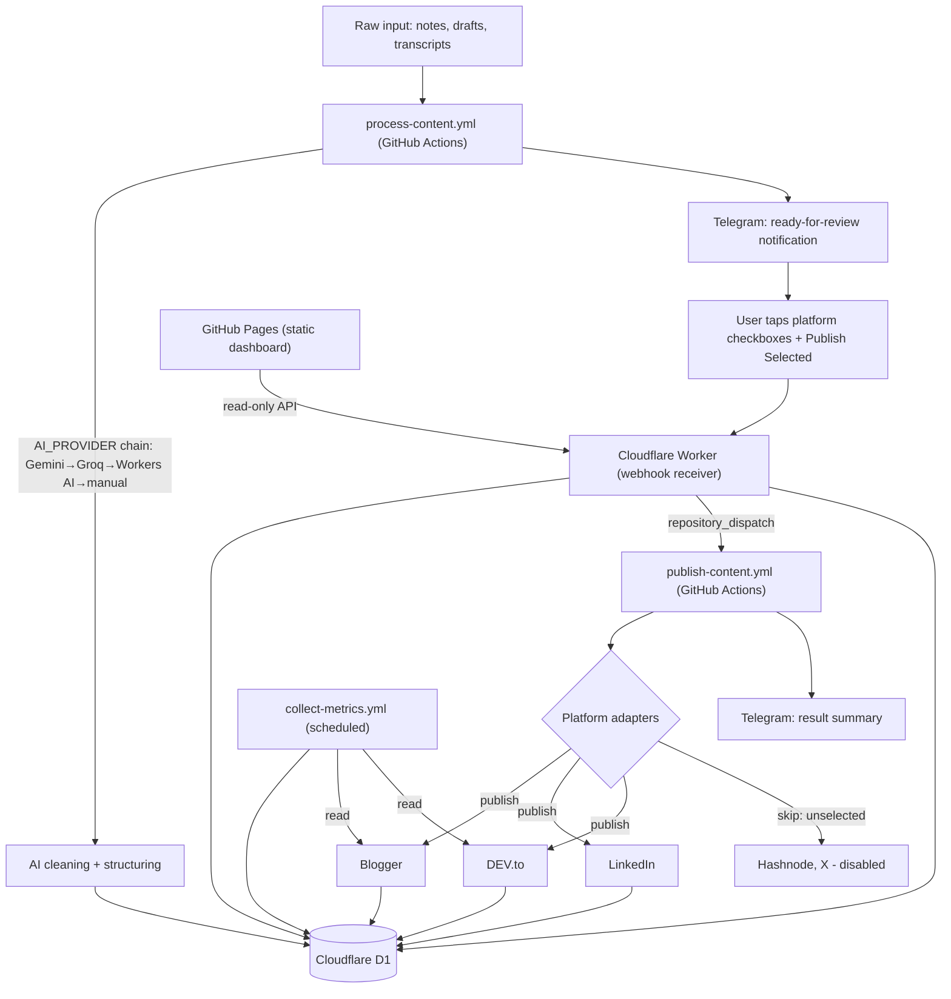

# ContentFlow AI — Research, Audit & Feasibility Report

**Companion file:** `ContentFlow-AI-02-Master-Build-Prompt.md` (hand that one to your coding agent once you've approved this)
**Prepared:** 30 Aug 2026 · **Budget constraint verified against:** official docs/pricing pages where available, dated below · **Status:** Phase 0 output — no code has been written

## 0. How your two documents were merged

You uploaded two versions of the same brief: one framed as "build it, but do the requirements analysis first," the other as "research it deeply, then hand me a prompt for a coding agent." They describe one project. This file does the research/audit/feasibility work both asked for; the companion file is the final build prompt both asked for. Nothing in either original document was ignored — where the two differed (e.g. doc 2's much deeper platform-by-platform interrogation), I followed the more rigorous one.

---

## 1. Executive Summary

**Yes, this is buildable at ₹0**, with two platforms removed from the MVP and a handful of corrections to assumptions that were reasonable in early 2026 but are no longer true today. The single biggest risk to your ₹0 constraint isn't any one service being expensive — it's that **"free" API terms move fast**, and three of them moved between your training-data-era assumptions and today. That's not a hypothetical: it happened three times in the last four months, discovered while researching this exact document:

| # | What changed | When | Source |
|---|---|---|---|
| 1 | **X (Twitter) API** dropped its free tier entirely; new developers default to pay-per-use ($0.015/post, $0.20/post with a link, $0.005/read) | 6 Feb 2026 | X's own developer forum + docs.x.com/x-api/getting-started/pricing |
| 2 | **GitHub Models** (the free "call any model with your GitHub token" service) was **fully retired** | 30 Jul 2026 — one month ago | github.blog/changelog |
| 3 | **Hashnode's GraphQL API** stopped being free — publishing now requires a paid Hashnode Pro plan on the publication | 13 May 2026 | hashnode.com/changelog |
| 4 | **LinkedIn**: posting to your own profile is free and self-serve, but reading back your own post's likes/comments is *not* self-serve (`r_member_social` is "granted to select developers only"), and LinkedIn's Restricted Use Policy caps storage of member social-activity data at **48 hours** — which conflicts directly with "store historical metric snapshots" | ongoing | LinkedIn/Microsoft Learn developer docs |
| 5 | **Supabase** free projects **auto-pause after 7 days of inactivity** and free-tier has **zero backup retention** — a real risk for a database meant to hold irreplaceable content history | ongoing, confirmed current | supabase.com/docs/guides/platform/free-project-pausing |
| 6 | **Blogger API** has no pageview/analytics endpoint at all — "views" require a separate (also free) Google Analytics hookup | ongoing | developers.google.com/blogger + Blogger API reference |
| 7 | **Google OAuth apps left in "Testing" mode** issue refresh tokens that silently expire every **7 days** — an easy trap for exactly this kind of unattended automation | ongoing | support.google.com/cloud/answer/15549945 |

None of these are fatal. They just mean the MVP platform list is **Blogger + LinkedIn (posting only) + DEV.to**, with X and Hashnode marked optional/paid, and they change a few architecture decisions (below).

**MVP platform verdict at a glance:**

| Platform | In MVP? | Why |
|---|---|---|
| Blogger | ✅ Yes | Free, self-serve OAuth, full CRUD on posts, comments readable via API |
| LinkedIn | ⚠️ Partial | Posting: yes, free. Metrics/comments: no — not self-serve, and can't legally be stored long-term anyway |
| DEV.to | ✅ Yes | Free, simplest integration of all of them, API-key auth |
| Hashnode | ❌ Not in MVP | Publishing now requires paid Pro plan (changed 13 May 2026) |
| X (Twitter) | ❌ Not in MVP | No free tier since 6 Feb 2026 |
| Telegram | ✅ Yes (infra) | Free, primary approval channel |
| GitHub (Actions/Pages) | ✅ Yes (infra) | Free at this scale — see §16 |
| Cloudflare (D1/Workers) | ✅ Yes (infra) | Free at this scale — see §5, §16 |

---

## 2. Audit of Your Original Architecture

| You proposed | Verdict | Note |
|---|---|---|
| Raw → clean → structure → enrich → platform versions → review → select → publish → metrics → analytics | ✅ Sound | Kept as the spine of the design |
| Never publish to unselected platforms; default unselected | ✅ Sound, non-negotiable | Enforced structurally, not just by convention — see §11 |
| Media as metadata-only, no binaries in the DB | ✅ Sound | Kept; R2 is the documented upgrade path if you ever need it |
| GitHub Actions as orchestration engine | ✅ Sound | With one addition: use a **public** repo (see §6) |
| GitHub Pages for the dashboard | ✅ Sound, with a caveat | Pages is static-only; it cannot talk to D1 directly or hold secrets. Your own doc 1 anticipated this ("if GitHub Pages cannot securely perform an operation... use Cloudflare Worker"). Research confirms this isn't optional — a thin Worker API is required, not a nice-to-have |
| Telegram Bot for approval | ✅ Sound | Inline keyboards do exactly what you sketched |
| Cloudflare D1 or Supabase, pick one | ✅ Sound approach | D1 recommended — see §5 |
| Plugin/adapter architecture per platform | ✅ Sound | Kept, with an explicit "unsupported" return type baked into the interface, not bolted on |
| DRY_RUN mode, idempotency, no fake features | ✅ Sound, non-negotiable | Carried through unchanged |
| Blogger, LinkedIn, X, DEV, Hashnode as the platform set | ⚠️ Needs correction | X and Hashnode don't clear the ₹0 bar anymore (§1, §3) |
| "GitHub Models" mentioned as a candidate free AI option (implicit in your infra list) | ❌ No longer exists | Retired 30 Jul 2026 |
| Your original 15-entity schema | ⚠️ Redesigned, not copied | See §11 — `post_metrics` folded into `metric_snapshots` (having both a mutable "current" table and an immutable snapshot table for the same data is a bug waiting to happen), `approval_selections` split out from `approval_requests` so that changing a selection can cleanly invalidate the old approval per your own Requirement 30 |

---

## 3. Platform-by-Platform Capability & Free-Tier Matrix

Rather than one 20-column table per platform (unreadable), each platform gets a compact verdict row plus the detail underneath. All figures below are the specific numbers found in official or first-party sources during this research pass; "verify at build time" flags a number I could only confirm from a secondary source.

### 3.1 Content-publishing platforms

| Platform | Free to use? | Auth | Can publish? | Can read own comments? | Can read metrics? | Rate limit | Suitable for MVP? |
|---|---|---|---|---|---|---|---|
| **Blogger** | ✅ Yes | OAuth 2.0 (Google Cloud project, self-serve) | ✅ Create/update/delete posts | ✅ Comments resource exists in API v3 | ❌ No pageview endpoint in the API | Default ~10,000 requests/day (Google Cloud Console quota, adjustable) | ✅ **Yes — primary long-form platform** |
| **LinkedIn** | ⚠️ Partial | OAuth 2.0, "Share on LinkedIn" product (self-serve) | ✅ Text/image/article posts to your own profile via `w_member_social` | ❌ `r_member_social` is "granted to select developers only" — not self-serve | ❌ Requires Marketing Developer Platform / Community Management API partnership (weeks–months approval, not guaranteed for a hobby project) | ~100 calls/day/member | ⚠️ **Posting only** |
| **DEV.to (Forem)** | ✅ Yes | Personal API key (account settings, not OAuth) | ✅ Create/update articles, draft or published, Markdown body | ⚠️ Reaction/comment *counts* appear on the article object; a full comment-thread endpoint is not clearly documented — verify at build time | ⚠️ Same caveat as comments | 10 requests / 30 seconds (official Forem API docs) | ✅ **Yes** |
| **Hashnode** | ❌ No (since 13 May 2026) | Personal Access Token | ❌ `publishPost` and any publication-scoped read now require the publication to be on **Hashnode Pro** (paid, seat-based) | ❌ Same Pro gate | ❌ Same Pro gate | Public (non-publication) reads: 20,000 req/min. Mutations: 500 req/min — moot, since mutations need Pro anyway | ❌ **Not in MVP.** Mark `OPTIONAL / REQUIRES PAID PLAN` |
| **X (Twitter)** | ❌ No (since 6 Feb 2026) | OAuth 2.0 | ⚠️ Technically yes, but billed: $0.015/post (no link), $0.20/post with a URL | 💰 $0.005/read, capped at 2M reads/month | 💰 Same pay-per-use model | Credit-based, not a fixed quota | ❌ **Not in MVP.** Mark `NOT FREE` |

### 3.2 LinkedIn — special note (this was your Phase 4 ask)

The self-serve "Consumer" tier (Sign In with LinkedIn + Share on LinkedIn) genuinely costs ₹0 and requires no manual review — it covers exactly one thing well: **posting text/image content to the authenticated member's own feed.** Everything past that — company pages, impressions, likes-on-your-post, comment retrieval, scheduling — sits behind the Community Management API / Marketing Developer Platform, which LinkedIn gates by partner application with no published price and an unpredictable review timeline (third-party trackers report anywhere from ~4 weeks to 3–6 months, with no guarantee of acceptance for a personal project). Two extra points worth knowing before you plan around a future upgrade path:

- Even the restricted `r_member_social` read scope, when granted, is explicitly listed as available to *select developers only* — this is not a form you fill out and wait for, it's a discretionary allowlist.
- LinkedIn's Restricted Use Policy separately caps **storage of member social-activity data at 48 hours** and most profile data at 24 hours. Even in a hypothetical world where you got read access, your requirement to keep permanent historical `metric_snapshots` would not be allowed for LinkedIn-sourced data specifically. This is a policy wall, not a technical one — scraping around it would violate LinkedIn's terms, which this project explicitly rules out.

**Verdict:** LinkedIn is a real, free, self-serve **publish-only** channel. Metrics and comments for LinkedIn are `UNSUPPORTED` — the adapter should say so explicitly rather than silently returning nothing.

### 3.3 X (Twitter) — special note (your Phase 6 ask)

On 6 February 2026, X replaced its subscription tiers with pay-per-use as the default for new developers, confirmed on X's own developer forum and pricing docs. The old $200/month Basic and $5,000/month Pro tiers are closed to new signups (existing subscribers were grandfathered, then largely force-migrated after 1 June 2026). There is no meaningful free tier left: reads cost $0.005 each, writes cost $0.015–$0.20 depending on whether the post contains a link. **X is explicitly excluded from the ₹0 MVP.** If you ever want it back in, it's a config flip (`enabled_platforms.x: true`) plus a credit card — not a code change.

### 3.4 DEV.to / Hashnode / other blog platforms — your Phase 7 ask

- **DEV.to**: kept — cheapest integration effort of any platform here (a static API key, no OAuth dance), and still fully free as of this research pass.
- **Hashnode**: dropped from MVP for the reason in §3.1. If you later pay for Hashnode Pro for other reasons, re-enabling it is a config flip, same as X.
- **Medium**: Medium retired its public publishing API years ago and never brought it back — not investigated further because there's nothing to integrate against.
- **WordPress.com**: has a free-tier-compatible REST API, but you didn't ask for it and it doesn't add anything DEV.to/Blogger don't already cover — left out to avoid growing the platform count "simply to increase the number," per your own instruction.

### 3.5 Infrastructure platforms

| Service | Free? | Key limits (official source) | Role in this project |
|---|---|---|---|
| **GitHub Actions** | Public repos: unlimited on standard runners. Private repos (Free plan): 2,000 min/month + 500MB artifact storage | docs.github.com/billing | Orchestration engine |
| **GitHub Pages** | ✅ Yes, public repos only on the Free plan | 1GB site size, 100GB/month bandwidth (soft), 10 builds/hour (soft — waived if you deploy via a custom Actions workflow, which you will) | Static dashboard host |
| **Telegram Bot API** | ✅ Yes, no tier at all | 1 msg/sec/chat, 20/min/group, ~30/sec global | Approval channel |
| **Cloudflare D1** | ✅ Yes, "will always include a free tier" (Cloudflare's own wording) | 5GB storage, 5M rows read/day, 100K rows written/day, resets daily, **no pause/sleep** | Primary database |
| **Cloudflare Workers** | ✅ Yes | 100K requests/day, 10ms CPU/invocation | Webhook receiver + dashboard API |

---

## 4. AI Provider Comparison

Your brief was right to insist the AI layer be swappable — the one provider that looked like the "obvious free choice" a few months ago (GitHub Models) no longer exists. Everything below reflects that lesson: default to a **fallback chain**, never a single hard dependency.

| Provider | Free? | Typical free limits | Model quality | Caveat |
|---|---|---|---|---|
| **Google Gemini API** (AI Studio) | ✅ Yes, still active | Varies by model; Flash/Flash-Lite tiers are generous (RPM/TPM/RPD), no credit card | Good — Flash-tier is capable enough for cleaning/structuring/tagging | **Free-tier prompts may be used by Google to improve its products** — worth knowing since the input is the user's personal notes |
| **Groq** | ✅ Yes, no card | ~30 requests/min, ~1,000 requests/day per model (varies) | Open-source models only (Llama, GPT-OSS) — no proprietary models, but fast and plenty capable for this pipeline | Rate limits are per-organization, not per-key — creating more keys doesn't raise the ceiling |
| **Cloudflare Workers AI** | ✅ Yes | 10,000 "Neurons"/day, resets daily, ~80 open models | Good, open models | Nice architectural fit — same Cloudflare account as D1, one fewer credential to manage |
| **OpenRouter (`:free` models)** | ✅ Yes, at the base tier | 20 req/min always; **50 req/day** with $0 spent, rising to 1,000/day only after a **one-time $10 credit purchase** | Rotating catalog of 25–30 free models | The 1,000/day tier isn't ₹0-pure — it requires a one-time spend. Stay on the 50/day tier to keep this genuinely free. Free models get delisted with little notice; treat as a fallback, not a primary |
| **GitHub Models** | ❌ **Retired 30 Jul 2026** | — | — | Do not build against this. Included here only so this document explicitly overrides any older advice suggesting it |
| **Ollama (local)** | ✅ Free, but not automatable here | N/A — runs on your own machine | Depends on your hardware | GitHub Actions runners are CPU-only shared machines; a local LLM is impractical inside them. Positioned as `AI_PROVIDER=manual`'s big sibling — useful if you ever run part of the pipeline from your own computer, not from Actions |

**Recommendation:** an `AI_PROVIDER` abstraction with a fallback order — **Gemini Flash → Groq → Cloudflare Workers AI → manual** — where `manual` means a human fills in title/summary/tags/category themselves and the app works with zero AI calls at all. At this project's actual scale (see §16), any single one of the first three providers has more daily headroom than you'll ever use; the fallback chain exists purely as insurance against another GitHub-Models-style retirement, not because any one tier is tight.

---

## 5. Database Comparison

| | Cloudflare D1 | Supabase (Free) |
|---|---|---|
| Storage | 5 GB | 500 MB |
| Daily/monthly reset | Daily, resets to full quota every day, forever | N/A — monthly allowances, but... |
| **Pause behavior** | **None.** Cloudflare's own FAQ: *"the Workers Free plan will always include the ability to prototype and experiment with D1 for free"* | **Auto-pauses after 7 days of inactivity** (official Supabase docs). Restorable, but requires either remembering to log in or building a keep-alive ping — an extra moving part whose only job is defeating the platform's own idle policy |
| Backups on free tier | N/A (scale-to-zero compute; data persists) | **Zero days of backup retention** on the Free plan |
| Query engine | SQLite dialect | Full Postgres |
| Extra built-ins | None beyond the DB itself | Auth, Realtime, Storage, Edge Functions (none of which this project needs) |
| Access from GitHub Actions | Directly, via Wrangler CLI or the D1 HTTP API — no separate server required | Via the Supabase client/REST API |

**Decision: Cloudflare D1 is the primary database.** For a system whose entire value proposition is "reliably keep a permanent history of everything," a database that can silently go to sleep for a week if you take a short break is a worse fit than one that officially never does. Supabase remains a legitimate alternative if you specifically want Postgres or its bundled Auth/Storage — the schema in the build prompt is close enough to portable that switching later is a migration script, not a rewrite. Neon and Firebase were considered and dropped: Neon's free tier has similar auto-suspend behavior to Supabase without D1's advantages, and Firebase (Firestore) is a document store that fights this project's explicitly relational requirements ("avoid storing everything as one giant JSON blob").

---

## 6. Automation Comparison

GitHub Actions vs. the alternatives you asked me to weigh:

| Option | Verdict |
|---|---|
| **GitHub Actions** | ✅ Chosen. Free and unbounded on a **public** repo (see below), native secrets management, native `repository_dispatch` for external triggers, no separate infrastructure to run |
| n8n (self-hosted) | Rejected — "self-hosted" still needs a host, and you have no free always-on server. n8n Cloud is paid, ruled out by your own constraint |
| Cloudflare Cron Triggers | Kept, but as a *supplement* to Actions, not a replacement — used for the metrics-collection schedule and the Telegram keep-alive-free webhook, not for the heavier content-processing/publishing jobs |
| Plain scheduled GitHub Actions polling | Considered for the Telegram approval loop; rejected in favor of a Cloudflare Worker webhook (near-instant, doesn't burn Actions minutes waiting) |

**One concrete decision this research changes:** use a **public** GitHub repository for the automation code. Public repos get unlimited free Actions minutes and are a prerequisite for free GitHub Pages on the Free plan; private repos cap out at 2,000 minutes/month. This is safe because **your actual content — the raw notes, drafts, and everything sensitive — lives in Cloudflare D1, never in the git repository.** The repo holds code and workflow definitions only; credentials live in GitHub Actions Secrets (encrypted, never printed to logs). Nothing private is exposed by making the repo public. If you're uncomfortable with the code itself being public, a private repo works fine too — just budget against the 2,000 minute/month cap (see §16 for whether that's actually enough).

---

## 7. Notification & Approval Architecture

| Option | Verdict |
|---|---|
| **Telegram Bot, inline keyboards** | ✅ Chosen. Free, supports interactive per-platform checkboxes and Preview/Edit/Publish/Cancel buttons exactly as you sketched, negligible rate limits for single-user notification volume |
| GitHub Issues (comment-driven approval) | Considered — works, but the UX (typing exact commands in an issue comment) is worse than tappable buttons for a mobile-first approval flow, and doesn't map cleanly to per-platform toggles |
| GitHub Discussions | Same limitation as Issues, plus more setup overhead for no functional gain here |
| workflow_dispatch manual trigger | Kept as a *fallback* input method (you can always approve from the GitHub UI directly), not the primary one |
| Email | Free options exist but add another account/service; Telegram already does everything requested with less setup |
| Web dashboard only | Kept as the **secondary** approval surface for anything Telegram can't safely do interactively (see next paragraph) — not the primary, since your own brief wanted push notifications, which a static dashboard can't provide on its own |

**Chosen design:** Telegram is the primary channel. A Telegram inline keyboard can toggle platform selections and fire a final "Publish Selected" action directly — this is what Telegram's Bot API is built for, so nothing here needs a "secure fallback" for the core approve/select/publish loop. The one thing Telegram *can't* safely do is hold the actual publishing credentials or run the publish logic itself — that stays in GitHub Actions, triggered by the approval.

**Concrete data path (the part your original brief left implicit):**

This is why a Cloudflare Worker is required, not optional (§2): Telegram needs a persistent HTTPS endpoint to deliver button-taps to, and GitHub Actions has no such endpoint of its own. The Worker's *only* jobs are (a) receiving and verifying the Telegram webhook, and (b) exposing a small read-only API so the static GitHub Pages dashboard can display data from D1 without embedding a database credential in client-side JavaScript. Everything else — content processing, AI calls, actual publishing — stays in GitHub Actions, which is easier to audit, test, and keep secrets in.

---

## 8. Media Storage Analysis

Your rule stands as written: **no binaries in D1.** `media` rows store `media_type`, `description`, `alt_text`, `source_url`, `filename`, `mime_type`, and a JSON metadata field — nothing else. If you outgrow that later, **Cloudflare R2** (10GB storage, 1M writes/month, 10M reads/month, **zero egress fees** even on the free tier) is the natural next step, and it slots into the same Cloudflare account as D1 and Workers with no new provider relationship. Storing media in the GitHub repo itself was considered and rejected even though GitHub is free: it would bloat the repo (fighting the Pages 1GB soft limit), mixes binary assets with source-controlled code, and gives you no image-optimization/CDN behavior that R2 provides for free. This is intentionally left for a future phase, not built now.

---

## 9. Metrics & Comments Feasibility Matrix

| Platform | Views/impressions | Likes | Comments | Shares | Verdict |
|---|---|---|---|---|---|
| Blogger | ❌ Not in API (needs GA4) | N/A | ✅ Available | N/A | Comments: build it. Views: optional GA4 add-on, not MVP |
| LinkedIn | ❌ Requires partner approval | ❌ Requires partner approval | ❌ Requires partner approval, and unstorable past 48h anyway | ❌ Requires partner approval | `UNSUPPORTED` — document, don't fake |
| DEV.to | ⚠️ Not confirmed via public API | ⚠️ Reaction counts appear to be on the article object — verify | ⚠️ Verify at build time | N/A | Implement opportunistically, mark unverified fields clearly |
| X | 💰 Paid | 💰 Paid | 💰 Paid | 💰 Paid | Not in MVP, moot |
| Hashnode | 💰 Requires Pro | 💰 Requires Pro | 💰 Requires Pro | 💰 Requires Pro | Not in MVP, moot |

Where a platform can't provide a metric, the adapter's `getMetrics()`/`getComments()` returns an explicit `unsupported` result (see build prompt §6) that the dashboard renders as *"Comment collection unavailable for this platform"* — never a silently empty table that looks like zero engagement.

---

## 10. Security Threat Model

| Threat | Mitigation |
|---|---|
| API key / OAuth token leakage | All secrets live only in GitHub Actions Secrets and Cloudflare Worker secrets — never in the repo, never in D1, never sent to the frontend. Actions automatically masks secret values in logs |
| Google OAuth refresh tokens expiring every 7 days | OAuth consent screen set to **"In production"** publishing status (self-serve toggle; does not require Google's full verification review for a single-user personal tool — see §3, note the "unverified app" click-through warning may still appear once, which you accept as the account owner) |
| GitHub Actions script injection via untrusted input (raw content, AI output) | Untrusted text is never interpolated directly into shell `run:` steps — passed via `env:` variables only; third-party Actions pinned to a commit SHA, not a floating tag |
| Prompt injection via raw content into the AI layer | Raw content is treated as data, never as instructions; AI calls use structured/JSON output schemas; AI output that would touch a privileged operation (e.g. a "run this command" style claim) is never executed, only stored as text |
| Telegram webhook spoofing | Telegram's `secret_token` header verified on every webhook call before any action is taken |
| Replay / duplicate publish (retry fires twice) | Every `platform_posts` row carries a unique `idempotency_key`; the publish adapter checks for an existing successful post before calling the platform API |
| Unauthorized publish after selection changes | A new platform selection always creates a **new** `approval_request`; the previous one is marked `superseded` and can no longer trigger a publish — this is Requirement 30, enforced at the schema level, not just in application logic |
| Database exposure | D1 is reachable only from GitHub Actions (via a scoped Cloudflare API token) and the Worker (via Wrangler bindings) — never directly from the public dashboard |
| Frontend secret exposure | GitHub Pages ships zero credentials; all dashboard data requests go through the Worker's read-only, rate-limited API |

---

## 11. Data Model (ERD)

| Entity | Purpose | Key design decision |
|---|---|---|
| `content` | The raw input, immutable, plus a status state machine | `raw_text` is never overwritten — every transformation lives in `content_versions` instead |
| `content_versions` | Every transformation (cleaned/structured/per-platform/manually edited), chained via `parent_version_id` | Gives you the full RAW → CLEANED → STRUCTURED → BLOGGER/LINKEDIN/DEVTO lineage you asked for, without duplicating the raw text at each step |
| `media` | Metadata-only media references | No binary columns, ever, per Requirement rules |
| `platforms` | The global catalog, with capability flags (`supports_metrics`, `supports_comments`, etc.) | Encodes "unsupported" as *data*, so adding a platform later doesn't require touching every place that checks capabilities |
| `platform_accounts` | Connection status per platform, references a secret name — never the secret itself | Keeps `enabled_platform` (global) cleanly separate from per-post selection, per your Requirement 21 |
| `approval_requests` / `approval_selections` | Split into two tables on purpose | Lets a changed selection invalidate the old approval (mark it `superseded`) and start a fresh one, satisfying Requirement 30 exactly |
| `publishing_jobs` / `publishing_attempts` | One job per approved batch, one row per platform attempt (with retries) | Supports partial success ("Blogger → SUCCESS, DEV → FAILED") without treating the whole batch as failed |
| `platform_posts` | One row per (content version × platform account), carries the `idempotency_key` | This is the single source of truth for "has this already been published here" — the duplicate-protection check queries this table before ever calling an adapter's `publish()` |
| `metric_snapshots` | Append-only history | **This replaces your originally-listed `post_metrics` + `metric_snapshots` pair** — having a separately-updated "current" table alongside an immutable snapshot log is redundant (current = latest snapshot) and creates two places that can disagree. One table, always append, "current" is just `ORDER BY captured_at DESC LIMIT 1` |
| `comments` | Per-platform, only populated where legally/technically appropriate | Simply never written for platforms where retrieval is `UNSUPPORTED` (e.g. LinkedIn) rather than special-cased in code |
| `notifications` / `audit_logs` | Observability | Matches your Requirement 17/18 event list directly (see build prompt §13) |

Full column-level DDL is in the build prompt (§5) as ready-to-run migration files.

---

## 12. State Machines

---

## 13. System Architecture

---

## 14. Failure Scenario Table

| Scenario | Designed behavior |
|---|---|
| Blogger succeeds, LinkedIn fails, X unavailable | Each platform recorded independently in `platform_posts`; job status = `completed_with_errors`; single Telegram summary shows all three outcomes |
| Database unavailable mid-run | Workflow fails fast, retries with backoff on the next scheduled/triggered run; nothing is marked `published` without a confirmed D1 write |
| AI provider unavailable | Fallback chain advances to the next provider; if all fail, content is stored with `ai_provider: null` and flagged for manual completion — the human can still write the title/summary themselves and approve |
| Telegram unavailable | Approval falls back to the dashboard/`workflow_dispatch` manual trigger; nothing is silently skipped |
| Token expired | Adapter's `validateCredentials()` fails before any publish attempt; `platform_accounts.connection_status` flips to `token_expired`; a notification is sent rather than a failed publish attempt |
| Rate limit reached | Exponential backoff honoring the platform's documented `retry_after`/reset window; job pauses rather than failing outright if within a reasonable retry budget |
| Workflow timeout | Job status left as `running` is treated as stale after a threshold and requeued on next trigger, never silently re-published (idempotency key prevents duplicates even so) |
| Duplicate trigger (webhook fires twice) | `idempotency_key` uniqueness constraint on `platform_posts` — the second attempt sees the row already exists and short-circuits to `skipped: already published` |
| User changes platform selection after approving | Old `approval_request` → `superseded`; a brand-new approval is required (Requirement 30) |
| User presses "Publish Selected" twice | Second press against an already-`approved`/`publishing` request is a no-op; the button's callback checks current status before creating a new job |

---

## 15. MVP Definition & Phased Roadmap

Mapped to your original 12 phases, adjusted for what research changed:

| Phase | Scope | Change from your original plan |
|---|---|---|
| 1 | Architecture + requirements | This document |
| 2 | D1 schema + migrations, repo skeleton | Public repo, not private (§6) |
| 3 | Raw content ingestion | Unchanged |
| 4 | AI processing abstraction | Fallback chain (Gemini→Groq→Workers AI→manual), not a single provider |
| 5 | Review UI (dashboard) | Talks to D1 only via the Worker API, never directly |
| 6 | Telegram notification/approval | Includes the Worker webhook receiver — this wasn't a separate phase in your plan, but it's a hard prerequisite for Phase 6 to actually work end-to-end |
| 7 | Blogger adapter | Unchanged, MVP platform |
| 8 | LinkedIn adapter | **Publish-only** — `getMetrics`/`getComments` implemented as explicit `unsupported`, not built out |
| 9 | Metrics | Blogger comments + DEV.to (best-effort); LinkedIn/X/Hashnode excluded |
| 10 | Additional platforms | DEV.to moves up into MVP proper (it's this cheap to add, no reason to defer); Hashnode/X live here as **disabled-by-default, config-flip-to-enable** for whenever you're willing to pay |
| 11 | Analytics dashboard | Unchanged |
| 12 | Hardening + testing | Unchanged |

---

## 16. ₹0 Feasibility Verdict & Capacity Model

Estimated load at increasing personal-project scale (each "post" ≈ 1 raw item → ~3 platform versions):

| Monthly posts | Platform-publish events | GH Actions minutes (public repo) | D1 writes/day | AI calls/day | Telegram msgs/day | Verdict |
|---|---|---|---|---|---|---|
| 10 | ~30 | Unlimited (public repo) | <20 | ~4 | <1 | Trivial headroom everywhere |
| 50 | ~150 | Unlimited | ~50 | ~15 | ~2 | Trivial headroom everywhere |
| 100 | ~300 | Unlimited | ~100 | ~30 | ~3 | Trivial headroom everywhere |
| 500 | ~1,500 | Unlimited (would exceed the 2,000-min **private**-repo cap — another reason to stay public) | ~600 | ~130 | ~17 | Still comfortably inside D1's 100K writes/day and every AI provider's free daily cap |

**Verdict: ₹0 holds at every scale in your stated range**, provided the repo stays public. The only two things that break ₹0 are choices, not limits: enabling X or Hashnode, or switching the repo to private without accounting for the 2,000-minute cap at high volume.

---

## 17. Risks, Limitations & What to Re-Verify

- **Free-tier terms change without much notice** — this is not theoretical; it's the headline finding of this exact research pass (X, Hashnode, GitHub Models all changed in the last seven months). Before relying on this document long after its prepared date, re-check the official pricing pages linked in §18, especially for AI providers.
- LinkedIn's refresh-token lifetime (reported as ~60-day access tokens, ~365-day refresh) came from a single secondary source — confirm the exact figures in your own LinkedIn Developer Portal app settings before building the token-refresh workflow.
- DEV.to's article-object fields for reaction/comment counts are reported by community sources, not confirmed against DEV's own schema reference in this pass — verify the exact field names when you build the adapter.
- Blogger's ~10,000 requests/day default quota is a commonly cited figure, not something Google publishes as a fixed guarantee — check the actual quota shown in your Google Cloud Console after enabling the API, since Google can and does adjust defaults.
- Nothing here constitutes legal advice on platform Terms of Service; the security/threat-model section reflects a good-faith reading of each platform's public developer policies at the time of writing, not a legal opinion.

---

## 18. Sources

- LinkedIn: `learn.microsoft.com/en-us/linkedin/marketing/*` (official Microsoft-hosted LinkedIn developer docs), restricted-use-cases page
- X: `docs.x.com/x-api/getting-started/pricing`, `devcommunity.x.com` (X's own developer announcements)
- GitHub Models retirement: `github.blog/changelog/2026-07-01-...` and `2026-07-30-...`
- Hashnode: `hashnode.com/changelog/2026-05-13-graphql-api-paid-access`, `github.com/Hashnode/gql-skill`
- GitHub Actions/Pages: `docs.github.com/billing`, `docs.github.com/en/pages/getting-started-with-github-pages/github-pages-limits`
- Cloudflare D1/Workers/Workers AI: `developers.cloudflare.com/d1/platform/pricing/`, `developers.cloudflare.com/workers/platform/pricing/`, `developers.cloudflare.com/workers-ai/platform/pricing/`
- Supabase: `supabase.com/docs/guides/platform/free-project-pausing`, `supabase.com/pricing`
- Telegram: `core.telegram.org/bots/faq`
- Google OAuth token expiry: `support.google.com/cloud/answer/15549945`
- Blogger API: `developers.google.com/blogger`
- DEV.to/Forem API: `developers.forem.com/api/v0`
- Gemini/Groq/OpenRouter free tiers: verified against provider pricing pages and cross-checked against multiple independent trackers dated within the last month
