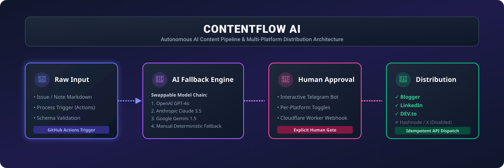
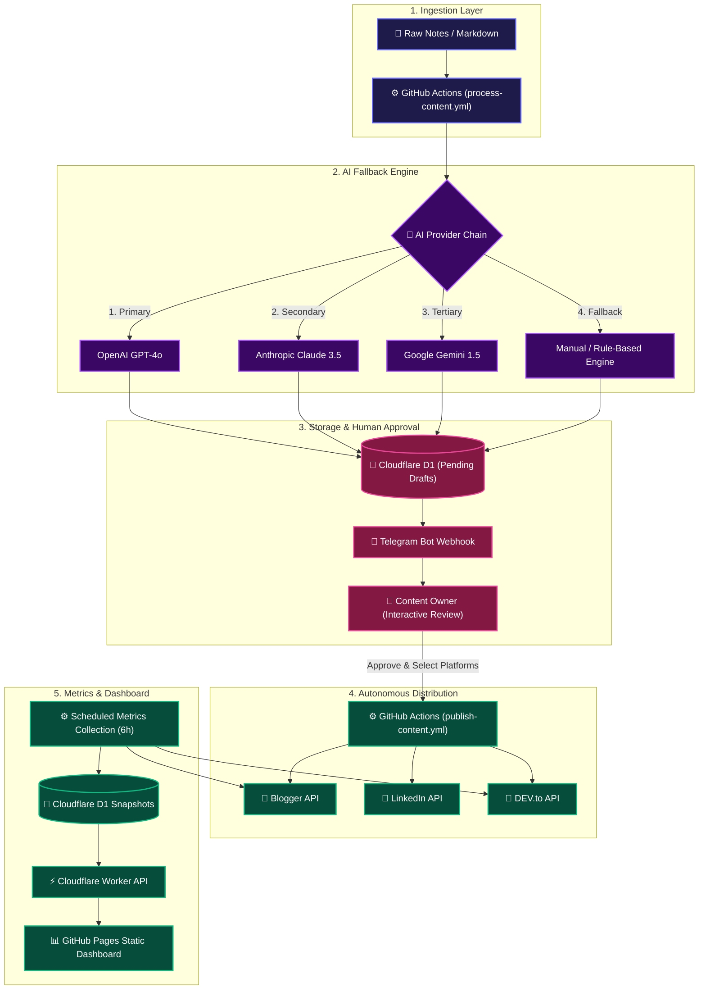
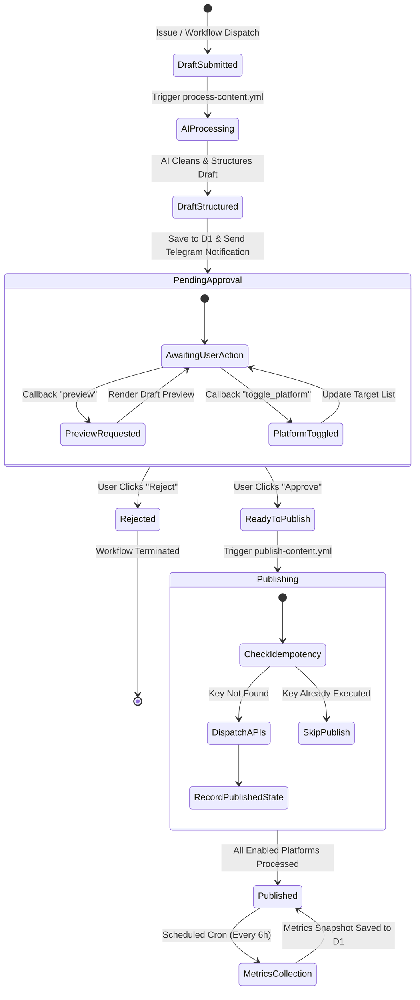
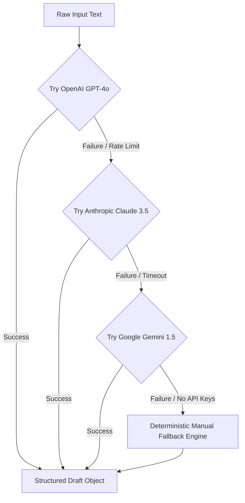
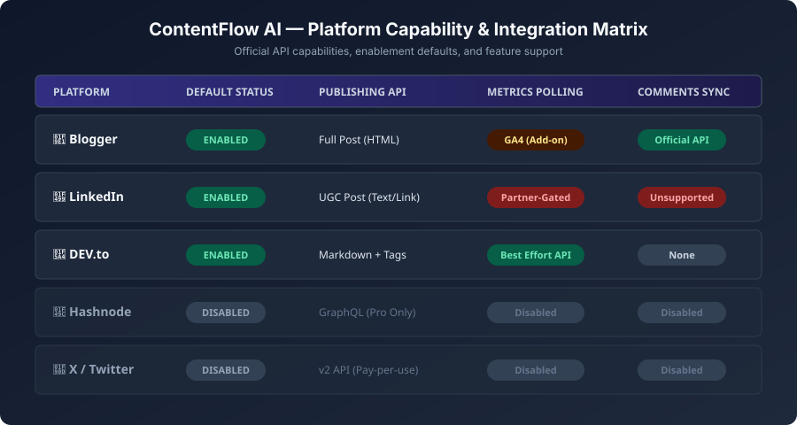
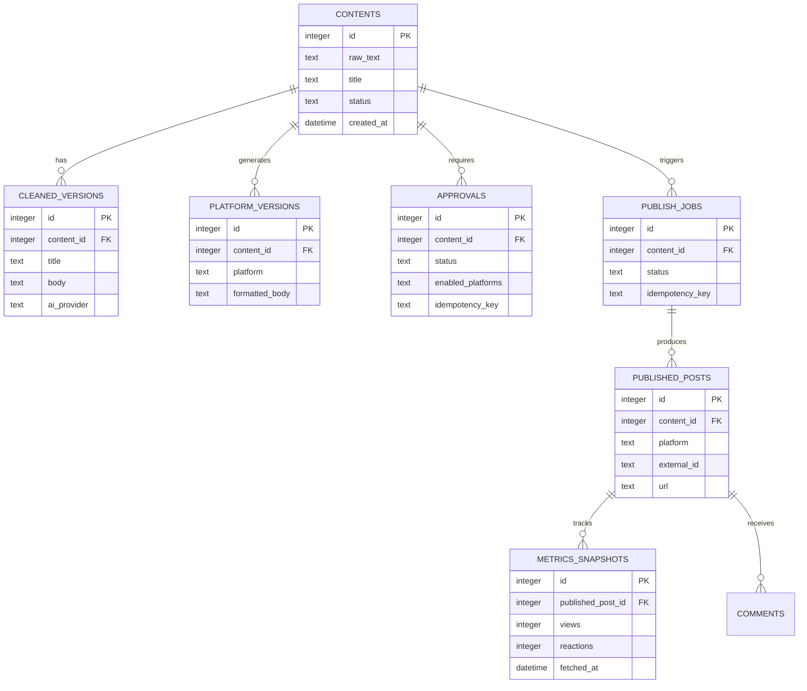
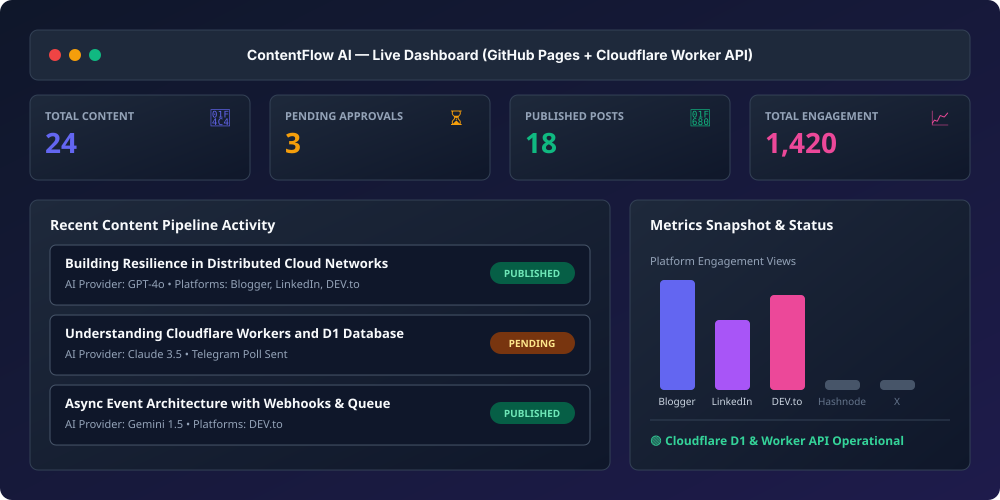

# 🚀 ContentFlow AI

An end-to-end, AI-assisted content ingestion, structuring, approval, multi-platform publishing, and analytics pipeline.

ContentFlow AI turns raw developer notes or markdown posts into platform-optimized content, routes structured drafts to Telegram for explicit per-platform human approval, publishes asynchronously to enabled channels via official APIs, and tracks post-level metrics in a Cloudflare D1 database exposed to a static dashboard on GitHub Pages.

---

## 📐 System Architecture Overview



### High-Level Data Flow



---

## ✨ Key Features & Capabilities

- 🤖 **Swappable AI Provider Chain**: Automatic runtime fallback across OpenAI (GPT-4o), Anthropic (Claude 3.5), Google Gemini (1.5), and a zero-credential deterministic manual parser.
- 💬 **Interactive Telegram Approval**: Review AI-structured drafts directly in Telegram with per-platform toggle buttons before any external API call is dispatched.
- 🛡️ **Strict Human-in-the-Loop Safeguards**: Posts remain safely stored in draft status until explicit user authorization.
- 🔑 **Idempotency Guarantee**: Deterministic SHA-256 idempotency keying prevents duplicate publishing across automated retries or worker restarts.
- 📊 **Multi-Platform Analytics**: Periodic metrics collection and comments polling stored as immutable snapshots in Cloudflare D1.
- ⚡ **Serverless & Zero-Cost Architecture**: Runs on GitHub Actions, Cloudflare Workers, Cloudflare D1, and GitHub Pages.

---

## 🔄 Content Lifecycle & Approval State Machine



---

## 🤖 AI Provider Fallback Engine

ContentFlow AI features a resilient provider fallback system. If an API provider experiences downtime, rate limits, or quota exhaustion, the pipeline gracefully fails over to the next provider without failing the workflow.



### Provider Matrix

| Priority | Provider | Model | Fallback Trigger |
| :---: | :--- | :--- | :--- |
| **1** | **OpenAI** | `gpt-4o` | Rate limit (429), API outage (5xx), invalid key |
| **2** | **Anthropic** | `claude-3-5-sonnet` | Network timeout, payload error |
| **3** | **Google** | `gemini-1.5-flash` | Quota exceeded |
| **4** | **Manual** | Rule-Based Regex / Parser | Zero API keys configured or total cloud failure |

---

## 🌐 Platform Capabilities & Matrix



| Platform | Default Status | Publishing Payload | Metrics Polling | Comments Sync |
| :--- | :---: | :--- | :--- | :--- |
| **Blogger** | ✅ `Enabled` | Full HTML Article | GA4 Integration (Optional) | ✅ Official Comments API |
| **LinkedIn** | ✅ `Enabled` | UGC Post (Text + Link) | ❌ Partner-Gated (48h limit) | ❌ Partner-Gated |
| **DEV.to** | ✅ `Enabled` | Markdown + Tag Array | ✅ Reactions & Views API | ❌ N/A |
| **Hashnode** | 🛑 `Disabled` | GraphQL API (Pro Tier) | 🛑 Disabled | 🛑 Disabled |
| **X (Twitter)** | 🛑 `Disabled` | Twitter API v2 (Pay-per-use) | 🛑 Disabled | 🛑 Disabled |

---

## 🗄️ Database Schema & D1 Architecture

The pipeline uses **Cloudflare D1** (SQLite at the edge) for structured persistent storage.



Migrations live in `migrations/` (`001_initial_schema.sql` through `008_add_indexes.sql`).

---

## 📊 Static Dashboard & Analytics Visualizer



The frontend is a zero-dependency static web application hosted on **GitHub Pages** that connects to the Cloudflare Worker API.

- **Offline Mode**: Renders mock historical data when loaded without an API endpoint.
- **Live Worker Mode**: Pass `?api=https://your-worker.workers.dev` to connect to your live D1 database.
- **Metrics Tracked**: Total posts, pending approvals, multi-platform publishing history, engagement views, reactions, and comment feeds.

---

## ⚙️ GitHub Actions Workflows

| Workflow | File Path | Trigger | Purpose |
| :--- | :--- | :--- | :--- |
| **Process Content** | `.github/workflows/process-content.yml` | `workflow_dispatch` / `content-submitted` | Ingest raw notes, invoke AI fallback, push draft to D1, send Telegram prompt. |
| **Publish Content** | `.github/workflows/publish-content.yml` | `workflow_dispatch` / `publish-approved` | Dispatch idempotent multi-platform publishing jobs for approved posts. |
| **Collect Metrics** | `.github/workflows/collect-metrics.yml` | Cron (`0 */6 * * *`) | Poll platform APIs for engagement metrics and comments; save snapshots to D1. |
| **Refresh Tokens** | `.github/workflows/refresh-tokens.yml` | Daily Cron | Validate OAuth refresh token health across integrated services. |
| **Cleanup** | `.github/workflows/cleanup.yml` | Weekly Cron | Purge stale publishing job logs and temporary workflow artifacts. |
| **CI / Tests** | `.github/workflows/test.yml` | Push / Pull Request | Run test suite with `DRY_RUN=true` against in-memory SQLite schema. |
| **Deploy** | `.github/workflows/deploy.yml` | Push to `main` | Build & deploy static dashboard to GitHub Pages & worker to Cloudflare. |

---

## 🛠️ Local Development & Quickstart

### Prerequisites

- **Node.js**: `v18.x` or higher
- **Python 3**: For running the local static dashboard server

### Installation

```bash
# Clone the repository
git clone https://github.com/your-username/ContentFlow-AI.git
cd ContentFlow-AI

# Install dependencies
npm install

# Run full test suite
npm test
```

### Local Development Servers

```bash
# 1. Run local static dashboard (http://localhost:4173)
npm run serve

# 2. In a separate terminal, run Cloudflare Worker API locally
npm run worker:dev
# Dashboard with live local API: http://localhost:4173/?api=http://localhost:8787
```

### Applying Local Database Migrations

```bash
# Apply migrations to local D1 instance
npm run db:migrate:local
```

---

## 🔐 Environment Variables & Configuration

Copy `.env.example` to `.env`:

```bash
# General Pipeline Configuration
DRY_RUN=true               # When true, simulates all publishing without making real API calls
AI_PROVIDER=manual         # Set to 'auto', 'openai', 'anthropic', 'gemini', or 'manual'

# AI Provider Credentials (Optional if using manual mode)
OPENAI_API_KEY=sk-...
ANTHROPIC_API_KEY=sk-ant-...
GEMINI_API_KEY=AIzaSy...

# Telegram Approval Bot
TELEGRAM_BOT_TOKEN=123456789:ABC...
TELEGRAM_CHAT_ID=-100123456789
TELEGRAM_SECRET_TOKEN=super-secret-webhook-token

# Platform Publishing Credentials
BLOGGER_CLIENT_ID=...
BLOGGER_CLIENT_SECRET=...
BLOGGER_REFRESH_TOKEN=...
BLOGGER_BLOG_ID=...

LINKEDIN_CLIENT_ID=...
LINKEDIN_CLIENT_SECRET=...
LINKEDIN_REFRESH_TOKEN=...
LINKEDIN_AUTHOR_URN=urn:li:person:...

DEVTO_API_KEY=...
```

---

## 🛡️ Security & Safeguards

1. **Explicit Human Approval**: No content is ever posted automatically without explicit user authorization via Telegram.
2. **Deterministic Idempotency**: Idempotency keys (`hash(content_id + platform + approval_timestamp)`) ensure posts are never duplicated upon workflow retries.
3. **Secret Isolation**: Credentials reside exclusively in GitHub Action Secrets and Cloudflare Worker Secrets. The public dashboard on GitHub Pages never receives or exposes API keys.
4. **Webhook Authentication**: All Telegram webhooks check `X-Telegram-Bot-Api-Secret-Token` headers before accepting callbacks.

---

## 📄 License & Status

- **Project Status**: ~90% ready; `DRY_RUN` end-to-end verified. See `NEXT-AGENT-REPORT.md` and `PROGRESS.md` for details.
- **License**: MIT License
